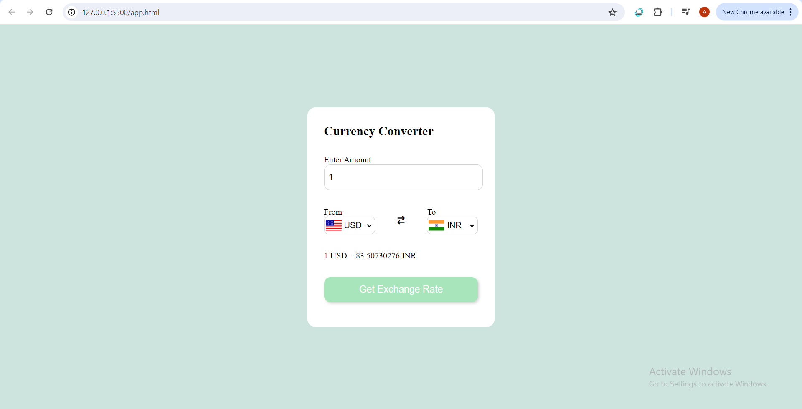

# Currency Converter

This is a simple currency converter web application built using JavaScript.

## Description

The Currency Converter allows users to convert currencies based on the latest exchange rates fetched from a remote API.

## Features

- Convert from one currency to another
- View latest exchange rates
- User-friendly interface

## Usage

1. Clone or download the repository.
2. Open the `app.html` file in your web browser.
3. Select the currencies you want to convert from and to.
4. Enter the amount you want to convert.
5. Click on the "Convert" button to see the converted amount.

## Dependencies

This project uses the following dependencies:

- [currency-api](https://www.npmjs.com/package/@fawazahmed0/currency-api): A JavaScript library for fetching latest currency exchange rates.
